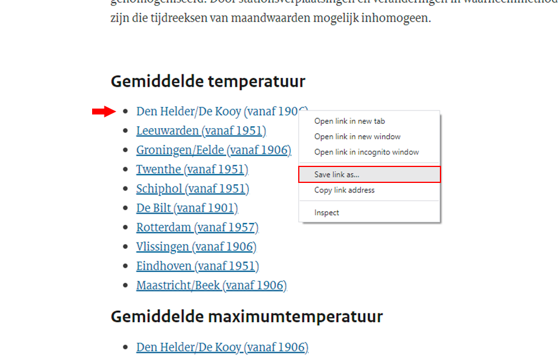
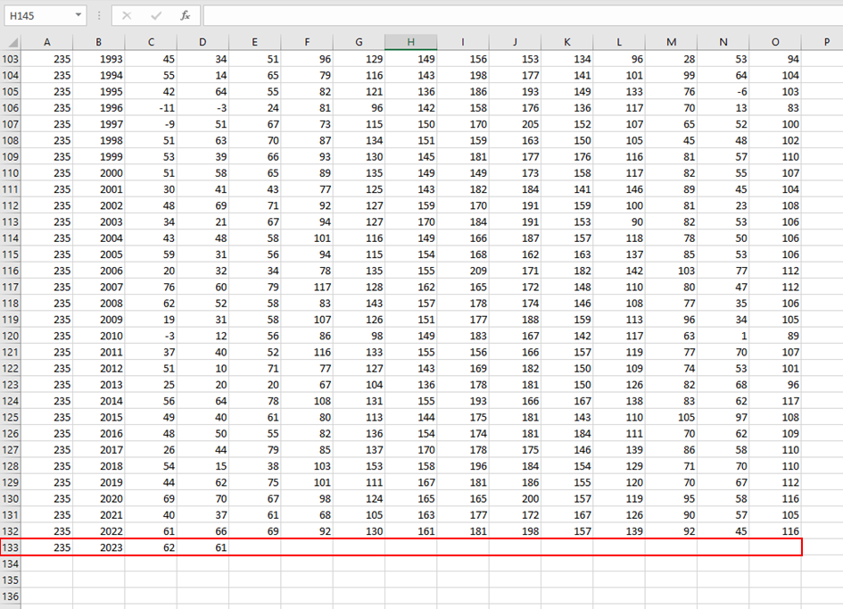
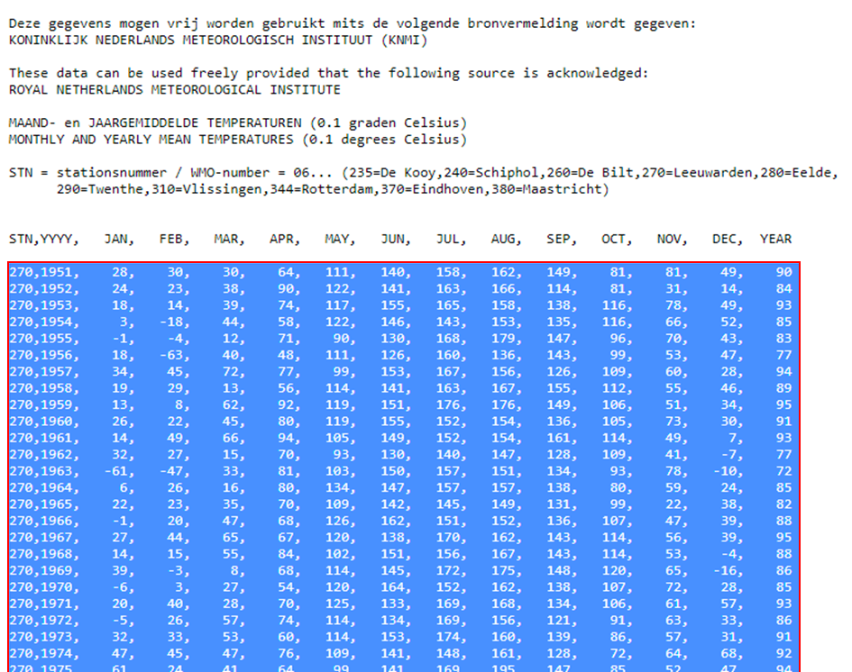
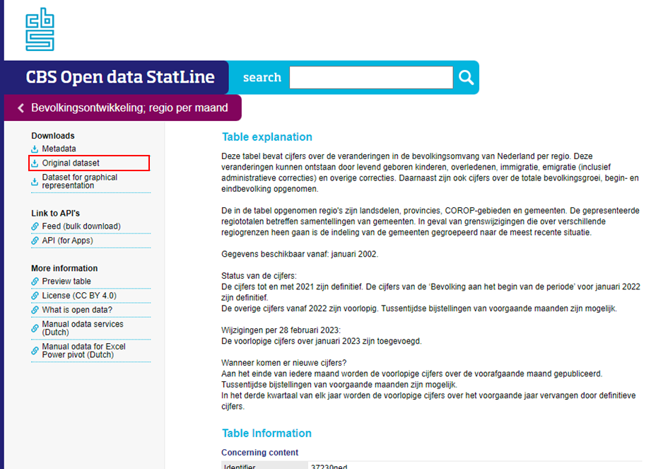
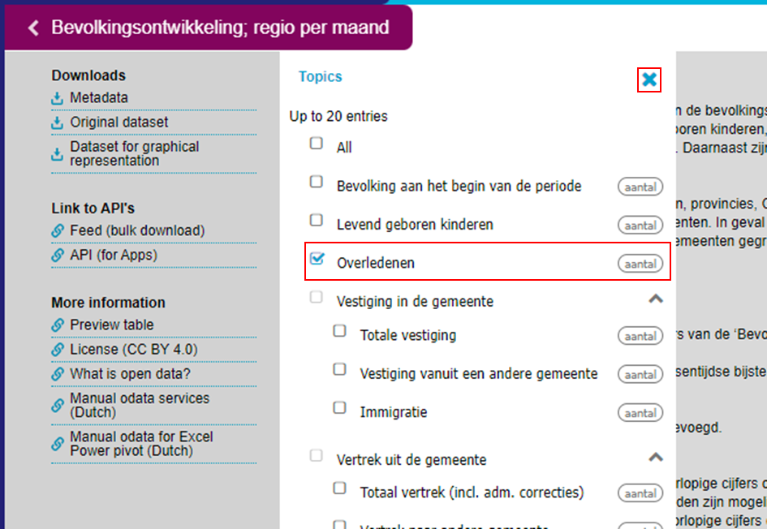
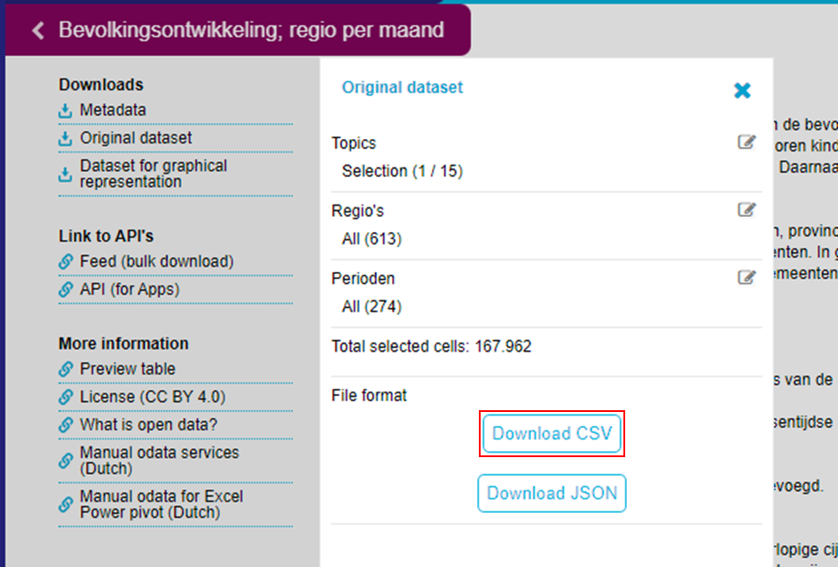

# Datasets

This document provides links to the datasets that are used in the research and instructions that need to be followed in order to be able to download the datasets. There are four datasets used in this research:

1. A dataset with monthly average temperatures of 10 weather stations in the Netherlands over the 70 to 100 years (depending on the station).

2. A dataset with the total number of deceased persons per township in the Netherlands over the past 20 years.

3. A dataset with geometry information of all the townships in the Netherlands.

4. A dataset with the coordinates of the included weather stations.

Below there are instructions on how to retrieve each dataset.

### Temperature data

The temperature data is retrieved from the Royal Netherlands Meteorological Institute (KNMI) via the following link:

https://www.knmi.nl/nederland-nu/klimatologie/maandgegevens

This link will bring you to the website of the KNMI. On the website, separate datasets of the 10 weather stations can be downloaded. In order to create the dataset that is used in this research, these 10 separate datasets need to be merged into one dataset, containing data from all the 10 stations. In order to do so, follow the instructions below.

##### 1. Download the first dataset
When you open the link above, you will see a header named 'Gemiddelde temperatuur' (Average temperature), with underneath a list of 10 weather stations. Right-click the first station in the list (Den Helder/De Kooy), and click 'Save link as...' to save this dataset to your computer. Important: save the dataset as a CSV file.

##### 2. Remove the last entry
After downloading the first dataset, open it on your computer. Remove the last entry of the dataset. This is the year 2023 which is not included in the research since it has not ended yet.

##### 3. Copy data from the other stations
Next, click the second station in the list. This will open a text file in the browser. Copy **only the values** of this file, and paste them underneath the values in the dataset of the first station that you just downloaded. Important: don't copy the last entry of the file. Again, this is 2023 and is not included in this research.

##### 4. Repeat
Repeat the previous step for all the remaining weather stations in the list. After this, the dataset is complete and ready to be used.

### Mortality data

The mortality data is retrieved from the Central Bureau of Statistics (Centraal bureau voor de Statistiek, CBS) via the following link:

https://opendata.cbs.nl/statline/portal.html?_la=en&_catalog=CBS&tableId=37230ned&_theme=260

In order to download the dataset, certain filters need to be applied. To do so, follow the instructions below.

##### 1. Select 'Original dataset'
When you open the link above, you will see a side menu on the left. In that menu, click the option 'Original dataset'. This will open an extra menu.

##### 2. Click ' Topics'
In the newly opened menu, click 'Topics'. This will open a menu where certain filters can be selected to filter the dataset.

##### 3. Filter the data
To filter the data so only the deceased data is downloaded, select 'Overledenen'. After this, close this menu by clicking the cross in the top right of the menu.

##### 4. Download the data
Lastly, click the buttton 'Download CSV' to download the dataset. The dataset is now ready for use.

### Township geometry data

The township geometry data can be directly downloaded by clicking the following link:

https://www.jerryvermanen.nl/wp-content/uploads/2012/01/Alle-gemeenten-in-Nederland.xls

This dataset does not need to be modified and is ready for use.

### Weather station coordinates
WIP