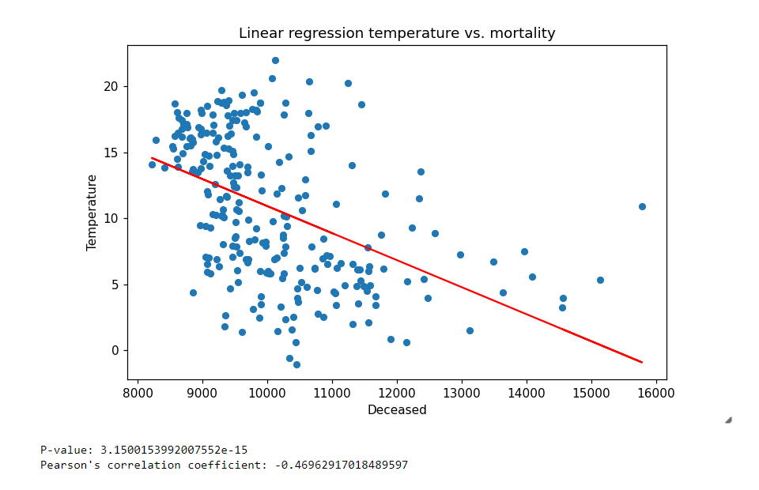

# Research correlation temperature and mortality in the Netherlands



The research in this repository aims to find out whether there exists a correlation between temperature and mortality in the Netherlands.

## Authors
Contributers of this repository: \
[@joost011](https://github.com/joost011) 

## Data
There are four datasets used in this research. Instructions on how to retrieve these datasets can be found in ```DATASETS.md``` in the repository.

## Installation

This project requires [Python](https://www.python.org/downloads/) and [Jupyter Notebook](https://jupyter.org/) to be installed.

### 1. Clone the repository
In order to clone the repository, run the following command:

```
git clone https://github.com/joost011/finalAssignment.git
```

### 2. Python libraries
After the cloning the repository, install the required libraries. The requirements.txt file contains a list of all the Python libraries that are required for running the code provided in this repository. After cloning the repository, run the following command in the root of the repository in order to install the required dependencies:

```bash
pip install -r requirements.txt
```

### 3. Config file
After installing the required libraries, copy ```config.example.yaml```, and remove ```.example``` from the newly created file name. This results in a file with the name ```config.yaml```. In this file, place the paths to the datasets that are examined during the research.

## Usage

In order to run the project, just run all the cells in ```main.ipynb ``` 

## License

Distributed under the [MIT](https://choosealicense.com/licenses/mit/) License. See LICENSE.txt for more information.
